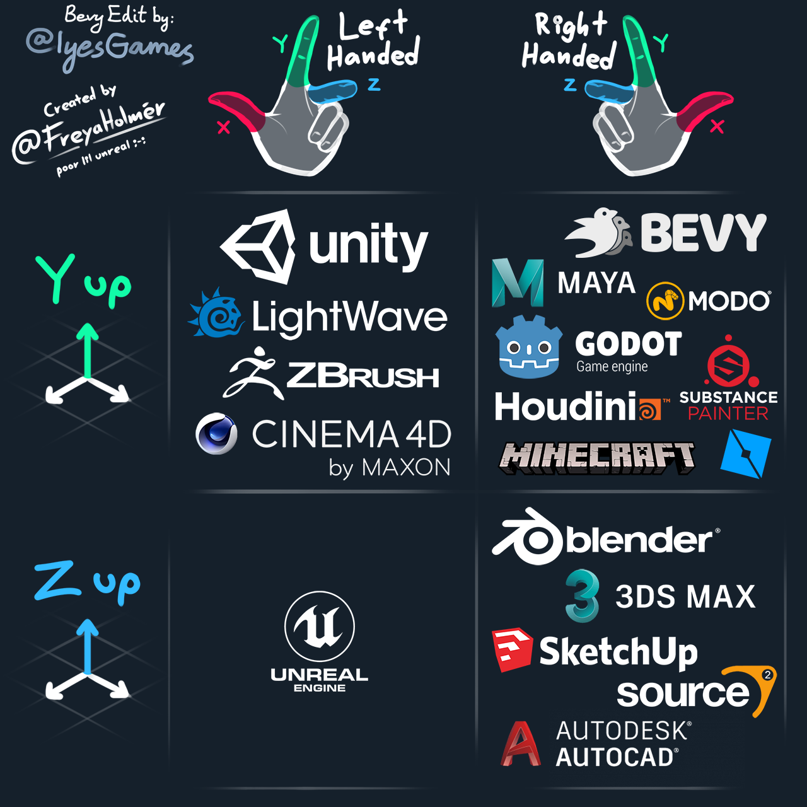
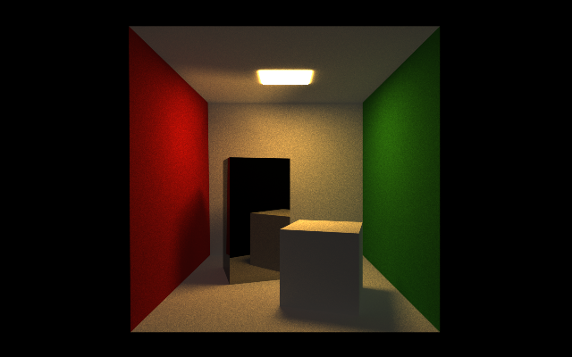
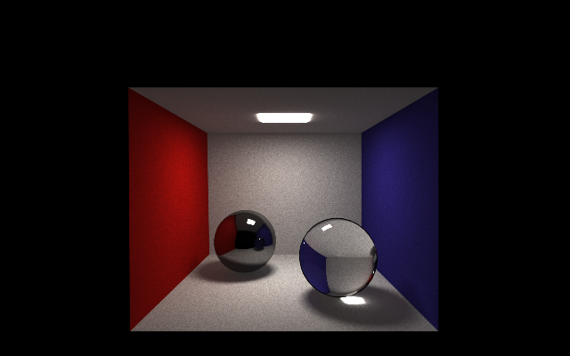
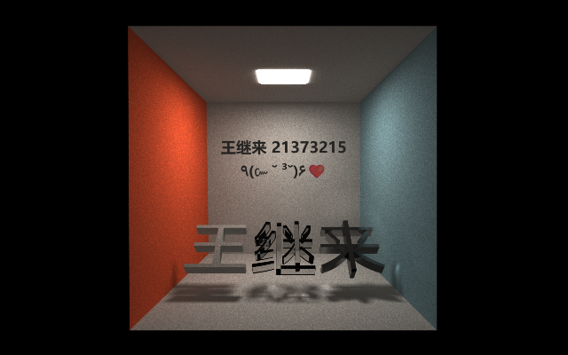

# Nebula

Nebula 是一个光线追踪渲染器，也是我 2024 秋季图形学课程的大作业。项目已开源，开源地址为[https://github.com/Endoctrine/nebula](https://github.com/Endoctrine/nebula)。

## 核心特性

- 使用 Rayon 库进行多线程加速
- 使用 BVH 加速渲染
- 支持从 .obj 加载模型
- 支持从 .mtl 加载材质
  - 支持发光材质与透明材质
- 支持漫反射贴图

## 如何运行

首先需要在本机安装 Rust。作为参考，我的 rustc 版本为 1.82.0。

向场景中添加物体主要通过 `Scene::add_obj()` 方法。这个方法
接收一个路径以及一个变换矩阵，其中，路径指向 OBJ 格式的物体，物体经过变换矩阵变换后加入到场景中。

Nebula 的场景坐标系与 Bevy 引擎一致。



```rust
fn main(){
  // ...
  let mut scene = Scene::new();
  scene.add_obj("scenes/CornellBoxMirror.obj", Mat4::IDENTITY);
  // ...
}
```

也可以通过 `Scene::add()` 方法向场景中直接添加图元。Nebula 中的图元有球和三角面两种。

定义摄像机通过 `Camera::new()` 方法，摄像机参数包含位置、视线方向、上方向、fov、长宽比、焦距、光圈。
光圈可以用来实现景深效果，不过会导致同样渲染参数下渲染结果中包含更多的噪点。

```rust
fn main(){
  // ...
  let look_from = Vec3::new(0.0, 1.0, 3.0);
  let look_at = Vec3::new(0.0, 1.0, -1.0);
  let vup = Vec3::new(0.0, 1.0, 0.0);
  let fov = 60.0;
  let aspect_ratio = 16.0 / 10.0;
  let focal_length = 4.0;
  let lens_radius = 0.0;

  let camera = Camera::new(
    look_from, 
    look_at, 
    vup, 
    fov, 
    aspect_ratio, 
    focal_length, 
    lens_radius,
  );
  // ...
}
```

现在，调用 `render::render()` 函数，传入刚刚定义好的场景与摄像机。通过函数参数可以定义图像的分辨率，递归深度以及 spp。

```rust
fn main(){
  // ...
  let image_width = 640;
  let image_height = 400;
  let max_depth = 5;
  let samples_per_pixel = 10000;
  
  let image_data = render::render(
    Arc::new(scene),
    Arc::new(camera),
    image_width,
    image_height,
    max_depth,
    samples_per_pixel,
  );
  // ...
}
```

最后，通过 `render::save_image_as_png()` 将渲染好的图像保存为 PNG 格式。

```rust
fn main(){
  // ...
  render::save_image_as_png(
    image_data,
    image_width,
    image_height,
    "output.png",
  );
  // ...
}
```

一切就绪，使用 `cargo run --release` 构建并运行。

## 代码功能与实现方法

Nebula 依赖了六个外部库，如下。

```toml
[dependencies]
glam = "0.29.2" # 用于进行线性代数运算
tobj = "4.0.2" # 用于解析 .obj/.mtl 文件
rand = "0.8.5" # 用于生成随机数
rayon = "1.10.0" # 用于并行运算
image = "0.25.5" # 用于读写图像文件
once_cell = "1.20.2" # 用于全局数据结构的异步加载
```

Nebula 采用 path tracing，核心渲染代码位于 `render::ray_color()` 函数中。

```rust
fn ray_color(){
  if let Some(hit) = scene.hit(ray, T_MIN, T_MAX) {
    let m = hit.material;
    let mut color = m.ambient_color() + m.emissive_color();
    // 如果弹射次数大于设定的次数，就不再弹射了
    if depth > max_depth {
      return color;
    }
    // 光线照射到物体后被分散为若干光线
    let scattered_rays = m.scatter(ray, hit);
    for scattered_ray in &scattered_rays {
      color += ray_color(&scattered_ray.ray, scene, depth + 1, max_depth)
              * scattered_ray.coefficient;
    }
    return color;
  }

  // 背景颜色为黑色
  Vec3::ZERO
}
```

对于光线颜色的计算是有偏的，因为递归层数是固定的，且额外增加了环境光 `m.ambient_color()` 以减少噪点，
这意味着几乎所有物体都在发光。我也尝试过 Russian Roulette，但是相同渲染时间下噪点似乎会更多，遂放弃。
环境光的强弱对于渲染结果影响很大，可以通过设置 `material::Material::AMBIENT_STRENGTH` 的值来控制，
示例中使用的环境光强度因子为 `0.2` 。

在将碰撞到物体的光线分散为多条的代码位于 `material::Material::scatter`，一条光线被分解为漫反射、
镜面反射以及透射共三条光线。

与场景相关的内容定义在 `scene` 模块中。构建 BVH 的代码位于 `scene/bvh.rs`，使用 AABB 包围盒以及表面积启发的分割轴判定方法。
图元位于 `scene/primitive.rs`，射线与图元的碰撞计算也在这个文件内，三角面采用顶点法向。

与摄像机相关的内容定义在 `camera` 模块中，摄像机采用薄透镜模型实现光圈效果，如下。

```rust
impl Camera{
  // ...
  /// 根据像素位置生成光线，实现薄透镜对于光线的折射
  pub fn get_ray(&self, horizontal_ratio: f32, vertical_ratio: f32) -> Ray {
    let random_in_lens = self.lens_radius * rand_util::random_in_unit_disk();
    let offset = self.u * random_in_lens.x + self.v * random_in_lens.y;

    // 焦平面上任意一点发出的光经薄透镜折射后，光的方向与透镜光心与该点连线平行
    let direction = self.lower_left_corner
            + self.horizontal * horizontal_ratio
            + self.vertical * vertical_ratio
            - self.origin;

    Ray::new(self.origin + offset, direction)
  }
  // ...
}
```

其余文件的作用如下。

- `ray.rs` 定义了光线结构体
- `texture.rs` 定义了存储纹理的全局变量，并定义了纹理采样方法
- `rand_util.rs` 定义了若干常用的随机方法

## 不足

- 开发 Nebula 时，原计划要做出一个包含图形化界面的渲染器，但软光线追踪的实时性太差，遂放弃
- Nebula 的渲染结果是有偏的
- Nebula 没有通过任何方法来降低噪声，需要很大的 spp 才能渲染出相对干净的画面
- Nebula 仅支持了漫反射贴图

## 示例

渲染示例图像所使用的渲染参数如下。

- image_width: 640
- image_height: 400
- max_depth: 5
- samples_per_pixel: 10000

部分场景数据来源于[这里](https://github.com/fabianishere/traceur/tree/master/assets)，且有所改动。

> 场景一：36 个三角面，渲染用时 4 min 43 s



> 场景二：2188 个三角面，渲染用时 12 min 30 s



> 场景三：2460 个三角面，渲染用时 21 min 45 s


